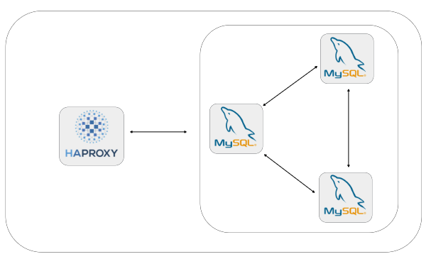
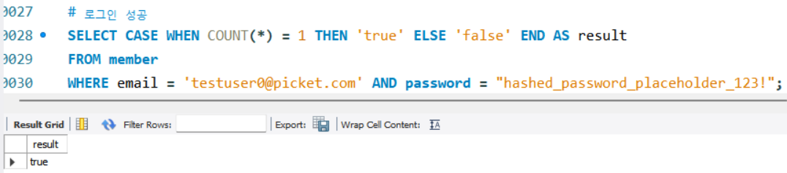

<h1 align="center">🎟️ Picket</h1>

  
  
<h3 align="center">2팀 - Picketnologia</h3>

  
  
## 👨‍💻 팀원 구성
<table align="center">
  <tr>
    <td align="center">
       
      <b>이상우</b> 
      Backend
    </td>
    <td align="center">
       
      <b>최경민</b> 
      Frontend
    </td>
    <td align="center">
       
      <b>강설</b> 
      Frontend
    </td>
        <td align="center">
       
      <b>김원중</b> 
      Frontend
    </td>
        <td align="center">
       
      <b>김광호</b> 
      Frontend
    </td>
  </tr>
</table>

  

## 🎫 프로젝트 소개

 최근 공연, 전시, 스포츠 이벤트에 대한 관심이 높아지면서 예매 플랫폼의 수요도 빠르게 증가하고 있습니다. 
기존 플랫폼들은 관심사 기반 알림, 대기열 시스템, 장애 복구 기능, QR 기반 티켓 제공 등을 통해 안정적인 예매 경험을 제공합니다.

 하지만 대부분의 플랫폼은 티켓 판매자가 직접 등록할 수 없고, 반드시 대행사를 통해야만 티켓을 판매할 수 있는 구조입니다. 
암표 방지 기능은 부족하며, 취소표 대기 기능은 일부 플랫폼에서만 제한적으로 제공되고 있습니다. 

 Picket은 판매자와 사용자가 모두 주체가 되는 새로운 티켓 예매 플랫폼입니다. 공연 기획자는 수수료 없이 직접 공연을 등록하고 티켓을 판매할 수 있으며, 
사용자는 관심사 기반 알림, 안정적인 대기열 예매, QR 인증 기반 암표 방지, 자동 결제/알림 기반의 취소표 대기 시스템 등을 통해 더 편리하고 공정한 예매 환경을 경험할 수 있습니다.
 
 Picket은 단순한 예매를 넘어, 누구나 공연을 열고 참여할 수 있는 열린 플랫폼을 지향합니다.
 
<!-- ← 여기 빈 줄 하나 추가 -->

  

## 👩‍🎤 기술 스택  

<!-- 1행 -->

<!-- 2행 -->

<!-- 3행 -->

<!-- 4행 -->

  

## 🎶 프로젝트 기획안
[프로젝트 기획안](./doc/프로젝트_기획안_최종_Picketnologia.pdf)

  

## 🎤 요구사항 정의서  
[요구사항 정의서](https://docs.google.com/spreadsheets/d/1m8R7l60UYcgNEaNdbqP5ly223e4l_r7a/edit?usp=sharing&ouid=106181506077522196158&rtpof=true&sd=true)

  

## 🕺 ERD
[ERD 다이어그램](./docs/requirement-spec.md)

  
  
  

## 💃 시스템 아키텍처

  

## 📽️ 재해 복구 (DR)

클러스터 방식을 사용한 이유

 
  
✔️ 데이터 일관성 유지  
  
클러스터는 노드 간 데이터 동기화를 통해 예매 정보, 좌석 상태, 결제 기록 등 중요한 데이터를 일관되게 유지한다.  
예매 중 한 서버가 다운되더라도 다른 노드가 동일한 데이터를 보유하고 있어, 좌석 중복 예매나 결제 누락 같은 문제를 방지할 수 있다.  

✔️ 부하 분산  
  
인기 공연/영화 티켓 오픈 시 대량 트래픽이 몰려도 여러 노드가 요청을 분산 처리한다.  
이를 통해 서버 과부하로 인한 예매 실패나 대기 시간 증가 없이, 안정적인 서비스 제공이 가능하다.  

✔️ 쓰기 작업에 최적화된 구조  
  
티켓팅 서비스는 좌석 선택, 결제, 예매 완료 등 실시간 쓰기 작업이 매우 빈번하다.  
클러스터는 다수의 노드가 병렬로 쓰기 요청을 처리하여, 빠른 응답성과 높은 처리량을 제공한다.  

✔️ 고가용성  
  
특정 노드에 장애가 발생해도, HAProxy 등 로드 밸런서를 통해 다른 노드로 자동 전환된다.  
따라서 예매가 중단되지 않고 지속적인 서비스 운영이 가능하며, 중요한 서비스일수록 필수적인 구조다.  

✔️ 유연한 확장성  
  
트래픽이 증가하면 노드를 손쉽게 추가하여 수평 확장할 수 있다.  
이벤트성 대형 공연, 연말 시즌 등 피크 트래픽에도 유연하게 대응할 수 있는 구조다.  

 

장애 복구 시나리오

 
  
✔️ 1대 장애 발생 시  
  
• HAProxy가 예매 서버 중 장애가 발생한 노드를 감지하고 해당 노드로의 트래픽을 자동으로 차단  
• 사용자(클라이언트)는 남은 두 대의 노드를 통해 예매 서비스를 계속 이용 가능  
• 문제가 해결되면 예매 서버(DB)를 재시작하고 클러스터에 다시 연결  
• 클러스터 내 정상 노드가 장애 노드에 예매 데이터(좌석 정보, 결제 내역 용  

✔️ 2대 장애 발생 시  

• HAProxy가 남은 1대의 예매 서버에 트래픽을 집중시켜 최소한의 서비스 유지  
• 각각의 장애 서버가 복구되면 순차적으로 재시작 후 클러스터에 재연결  
• 복구된 노드는 클러스터에 동기화되어 예매 관련 데이터가 자동 복원  

✔️ 3대 장애 예방  

• 티켓팅 시스템의 핵심 데이터(예매 정보, 결제 내역 등)를 정기적으로 백업하여 데이터 손실에 대비  
• 보조 DB 클러스터를 별도로 구축해, 예기치 못한 전체 장애 발생 시에도 빠르게 대체 가능  
• 예매가 몰리는 시즌이나 대형 공연을 대비해 보조 클러스터를 실시간 대기 상태로 유지  
• 장애 발생 시 메인 클러스터 대신 보조 클러스터를 즉시 전환·활성화하여 서비스 중단 없이 예매 지속 가능  

 

## 🦉 SQL

 

✅ **DDL**  

[DDL SQL 파일](./sql/picket_erd_schema.sql)

✅ **DML**  

[DML SQL 파일](./dml.sql)

 

사용자

 

로그인 성공
  

 

로그인 실패
  

 

