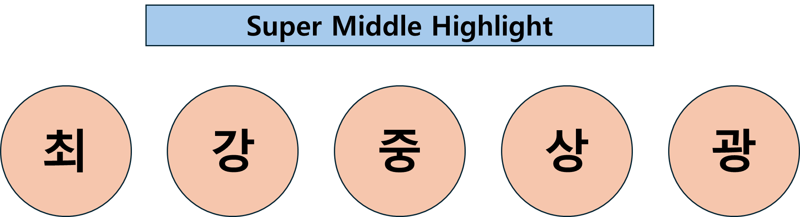

<h1 align="center">🎟️ Picket</h1>

  
  
<h3 align="center">1팀 - Picketnologia</h3>

  
  
## 👨‍💻 팀원 구성
<table align="center">
  <tr>
  
  

  </tr>
  <tr>
    <td align="center">
      <b>최경민</b> 
    </td>
    <td align="center">
      <b>강설</b> 
    </td>
    <td align="center">
      <b>김원중</b> 
    </td>
    <td align="center">
      <b>이상우</b> 
    </td>
    <td align="center">
      <b>김광호</b> 
    </td>
  </tr>
</table>

  

## 👩‍🎤 기술 스택  

<!-- 1행 -->

<!-- 2행 -->

<!-- 3행 -->

  
##🖥️ 시스템 아키텍쳐

## 📽️ CI/CD 배포 결과
###블루/그린 배포

## 🎬 CI/CD 시나리오
1. 개발자가 GitHub에 코드 푸시
   - 개발자가 GitHub에 push
2. Jenkins가 자동으로 GitHub 코드 감지
      - GitHub Webhook or Jenkins SCM Polling으로 push 감지
3. Jenkins가 Docker 이미지 빌드
      - Jenkinsfile 기반으로 docker build 실행
4. Jenkins가 이미지 DockerHub에 푸시
      - withCredential()로 이미지 업로드
5. Jenkins가 Kubernetes에 배포 명령 (kubectl apply)
      - SSH로 클러스터에 명령 전달
6. Kubernetes가 최신 컨테이너로 서비스 교체
      - Front: Ingress Canary
      - Back: Blue/Green Service 전환
// 7. 코드를 GitHub에 올리면 Jenkins가 자동으로 Docker 이미지로 만들고, Kubernetes가 서비스에 반영

## 🎫 CI/CD 파이프라인 흐름

### ⚙️ 자동 빌드 및 테스트
- Jenkins는 GitHub에 코드 푸시가 발생하면 자동으로 빌드를 시작합니다.
- Jenkinsfile을 활용해 프로젝트 빌드와 테스트를 실행하며, 지속적인 통합을 지원합니다.

### 🚀 배포 자동화
- 빌드가 성공하면 Dockerfile을 활용해 Docker 이미지를 생성하고, **Kubernetes (K8S)**를 통해 새로운 버전을 자동 배포합니다.

## 프론트엔드 - 카나리 배포 방식

카나리 배포 방식을 적용하여 클라이언트의 직접 테스트를 통해 안정적인 버전 업그레이드를 진행합니다.

❓ **카나리 배포 사용 이유**

티켓팅 서비스의 프론트엔드는 사용자 경험(UI/UX)에 민감한 요소입니다.  
예매 화면, 달력 UI, 좌석 선택 등 시각적이고 상호작용이 많은 요소에서 문제 발생 시 사용자 불만이 즉각적으로 나타납니다.  
카나리 배포를 통해 새로운 UI/기능을 일부 사용자에게만 제공함으로써, 안정성과 반응을 먼저 확인할 수 있습니다.  
장애 발생 시 빠르게 롤백이 가능하고, 사용자 전체에게 영향을 주지 않기 때문에 실제 사용자 피드백 기반의 개선이 가능합니다.

✅ **선택 이유 요약**  
UI 민감성 + 사용자 피드백 중요성 → 일부 사용자 대상 점진적 배포에 적합 → **카나리**

---

## 백엔드 - 블루/그린 배포 방식

블루/그린 배포 방식을 적용하여 새로운 버전(그린)으로 트래픽을 전환하며 무중단 배포를 실현하고, 기존 버전(블루)을 유지해 안정성을 보장합니다.

❓ **블루/그린 배포 사용 이유**

백엔드는 좌석 예매, 결제, 인증 등 중요한 트랜잭션 로직을 처리합니다.  
이러한 로직은 장애 발생 시 치명적인 사용자 피해로 이어질 수 있으므로, 완전한 안정성이 보장되어야 합니다.  
블루/그린 방식은 기존 버전을 유지한 상태로 새 버전을 준비하고, 완전한 테스트 이후 트래픽을 전환하므로, 문제가 발생해도 즉시 원래 상태로 되돌릴 수 있습니다.  
UI가 아니라 API 응답 중심이라 버전 차이도 사용자에게 거의 인식되지 않습니다.

